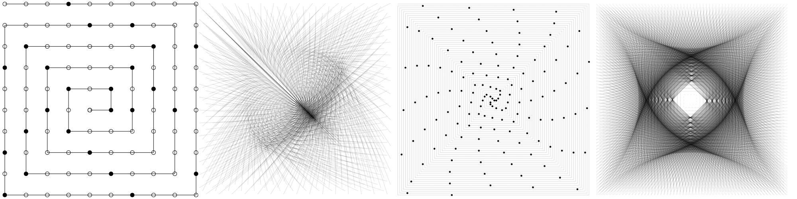

# Ulam Spiral Toy

A website for exploring the 
[Ulam spiral](https://en.wikipedia.org/wiki/Ulam_spiral).
Inspired by Jacob Yatsko's video 
[Extending Ulam Beyond Primes](https://www.youtube.com/watch?v=inrYsAusfPg").

Each circle on the spiral represents an integer, starting at 1 in the center, 
and increasing outwards.
This tool lets you colour in numbers, and draw lines in different ways.
The "classic" colouring has the primes coloured in black, shown by default.

Check out the 
[live site](https://asemahle.github.io/ulam-spiral-toy/index.html).

## Features:
- [Tweakpane](https://github.com/cocopon/tweakpane) control panel (:metal: NIFTY :metal:)
- Visualize your own functions using the function editor (:star: SO COOL :star:)
- Mostly works on mobile and touch (:boom: NEATO :boom:)
- Might break in mysterious ways (:sunglasses: WOW :sunglasses:)

## License
MIT License. See `LICENSE.txt` for more information.

